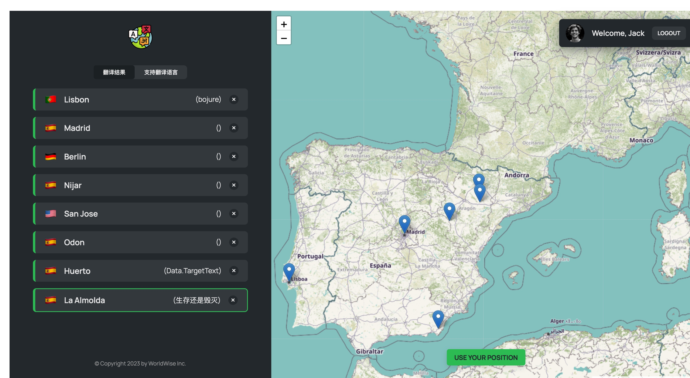

# 在线翻译系统




## 项目目录结构

```
.
├── README.md
├── data
│   └── cities.json
├── index.html
├── package-lock.json
├── package.json
├── public
│   ├── bg.jpg
│   ├── effect-1.jpeg
│   ├── effect-2.jpeg
│   ├── icon.png
│   ├── img-1.jpg
│   ├── img-2.jpg
│   ├── logo.png
│   └── vite.svg
├── src
│   ├── App.jsx
│   ├── components
│   │   ├── AppNav.jsx
│   │   ├── AppNav.module.css
│   │   ├── BackButton.jsx
│   │   ├── Button.jsx
│   │   ├── Button.module.css
│   │   ├── City.jsx
│   │   ├── City.module.css
│   │   ├── CityItem.jsx
│   │   ├── CityItem.module.css
│   │   ├── CityList.jsx
│   │   ├── CityList.module.css
│   │   ├── CountryItem.jsx
│   │   ├── CountryItem.module.css
│   │   ├── CountryList.jsx
│   │   ├── CountryList.module.css
│   │   ├── Form.jsx
│   │   ├── Form.module.css
│   │   ├── Logo.jsx
│   │   ├── Logo.module.css
│   │   ├── Map.jsx
│   │   ├── Map.module.css
│   │   ├── Message.jsx
│   │   ├── Message.module.css
│   │   ├── PageNav.jsx
│   │   ├── PageNav.module.css
│   │   ├── Sidebar.jsx
│   │   ├── Sidebar.module.css
│   │   ├── Spinner.jsx
│   │   ├── Spinner.module.css
│   │   ├── SpinnerFullPage.jsx
│   │   ├── SpinnerFullPage.module.css
│   │   ├── User.jsx
│   │   └── User.module.css
│   ├── contexts
│   │   ├── CitiesContext.jsx
│   │   └── FakeAuthContext.jsx
│   ├── hooks
│   │   ├── useGeolocation.js
│   │   └── useUrlPosition.js
│   ├── index.css
│   ├── main.jsx
│   └── pages
│       ├── AppLayout.jsx
│       ├── AppLayout.module.css
│       ├── Homepage.jsx
│       ├── Homepage.module.css
│       ├── Login.jsx
│       ├── Login.module.css
│       ├── PageNotFound.jsx
│       ├── Pricing.jsx
│       ├── Product.jsx
│       ├── Product.module.css
│       └── ProtectedRoute.jsx
└── vite.config.js

8 directories, 65 files
```

## 项目启动

**分支-master(前端代码)**

` npm run server`: 启动本地 json 服务器,为应用提供基本数据  
`nom run dev`:启动项目

**分支-backend**

`node index.js`: 启动后台服务器,调用用腾讯翻译api接口

## 代码提交规范

build：对构建系统或者外部依赖项进行了修改  
ci：对 CI 配置文件或脚本进行了修改  
docs：对文档进行了修改  
feat：增加新的特征  
fix：修复 bug  
pref：提高性能的代码更改  
refactor：既不是修复 bug 也不是添加特征的代码重构  
style：不影响代码含义的修改，比如空格、格式化、缺失的分号等  
test：增加确实的测试或者矫正已存在的测试
